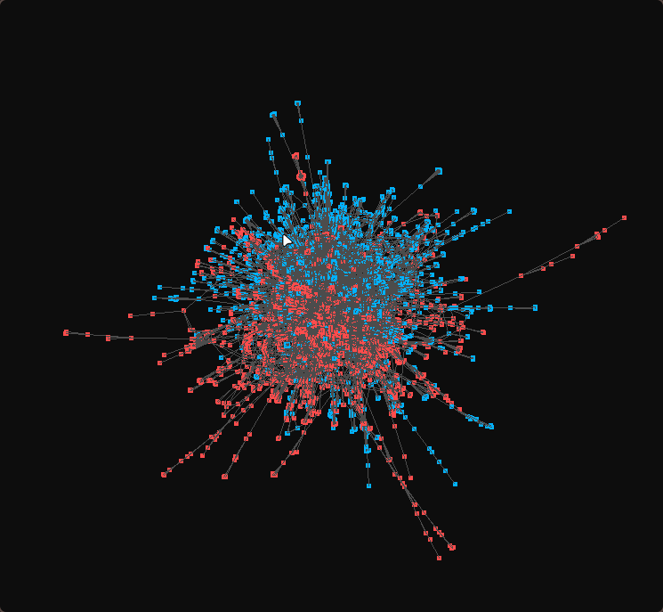
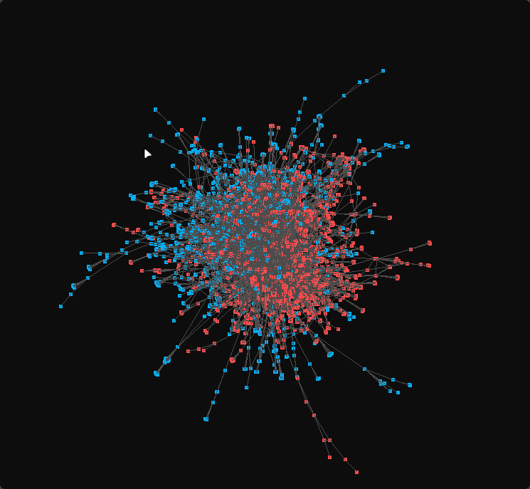
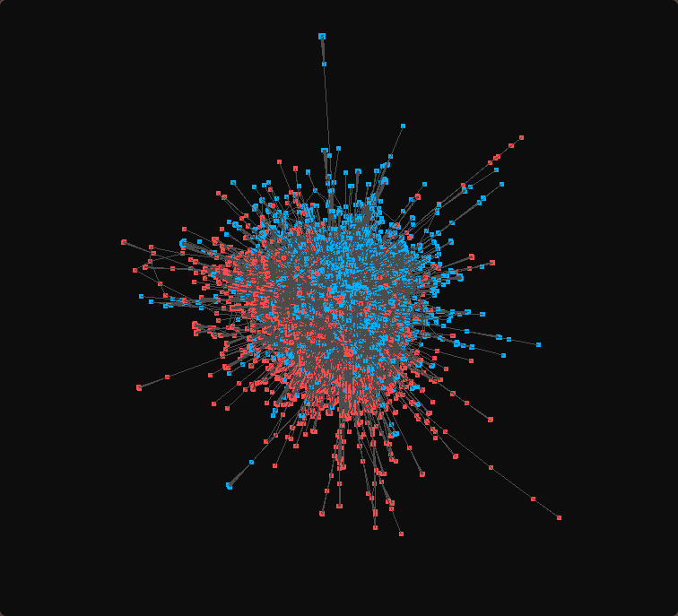
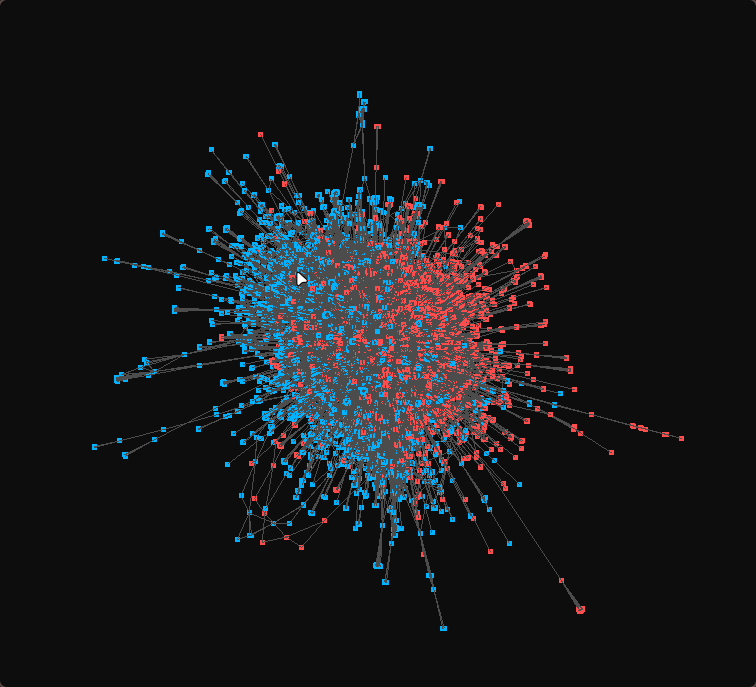
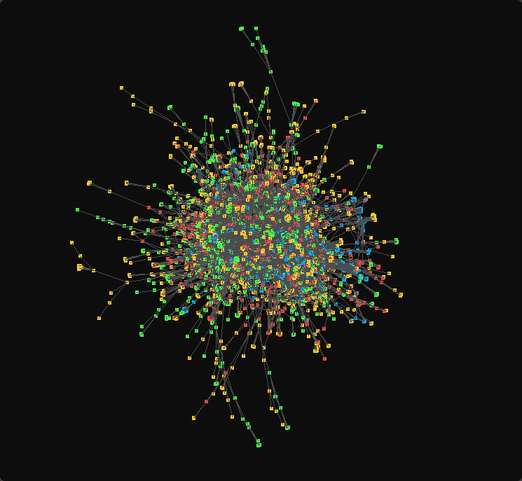
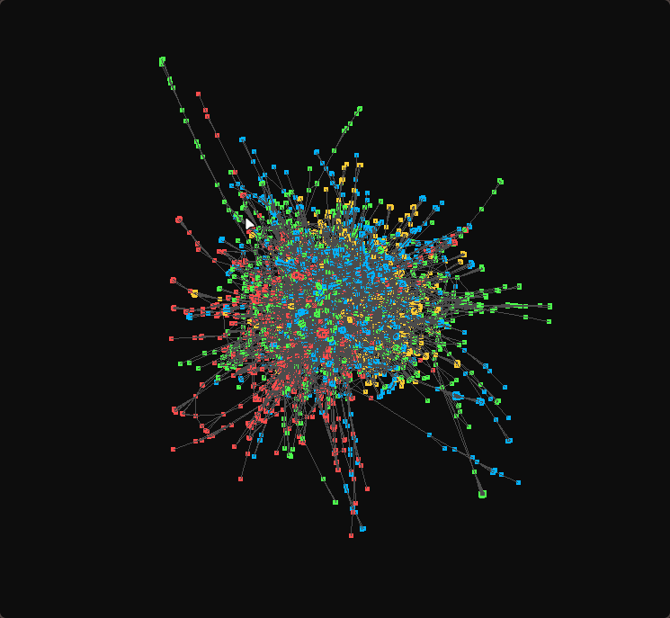

# Multilevel Graph Partitioning & Visualization

This project implements a high-performance framework for **Multilevel Graph Partitioning** and real-time visualization. It features a custom implementation of partitioning heuristics inspired by the **METIS** library and a physics-based graph layout engine powered by **CUDA**.

## Overview

The core of this project is a multilevel approach to graph bisection, which is essential for distributing computational loads in high-performance systems. The implementation covers the entire pipeline: **Coarsening** (graph contraction), **Initial Partitioning**, and **Uncoarsening** with refinement.

### Key Features:
- **Custom Multilevel Partitioning**: A from-scratch implementation based on the principles of Bichot & Siarry ("Graph Partitioning").
- **CUDA-Powered Physics**: Real-time force-directed graph layout visualization using CUDA kernels for $O(N^2)$ or $O(N \log N)$ force calculations.
- **Memory Optimization**: Effective use of **Shared Memory** on GPU to handle stable visualizations of up to 25,000 vertices.
- **Scalability**: Successfully processes and bisects large-scale real-world networks (e.g., collaboration and P2P networks) with up to 60,000+ vertices.

## Benchmarks & Results

This section compares the performance of my custom Multilevel Partitioning implementation (MY) against the industry-standard METIS library.

### 1. CA-GrQc (General Relativity Collaboration Network)
Link: [http://snap.stanford.edu/data/ca-GrQc.html](http://snap.stanford.edu/data/ca-GrQc.html)

*5,242 vertices, 57,936 edges*

| My Implementation | METIS Library |
|:---:|:---:|
|  |  |

**Bisection Metrics:**
Type | Cut weight | Part weights
| :---: | --- | --- |
MY | Cut weight: **1000** | Part weights: 2260 / 1898
METIS | Cut weight: **1002** | Part weights: 2079 / 2079

---

### 2. CA-HepPh (High Energy Physics Collaboration Network)
Link: [http://snap.stanford.edu/data/ca-HepPh.html](http://snap.stanford.edu/data/ca-HepPh.html)

*12,008 vertices, 473,956 edges*

| My Implementation (MY) | METIS Library |
|:---:|:---:|
|  |  |

**Bisection Metrics:**

Type | Cut weight | Part weights
| :---: | --- | --- |
MY |  **9396** |  6112 / 5092
METIS |  **11178** |  5217 / 5987

---

### 3. P2P-Gnutella30 (Peer-to-Peer Network)
Link: [http://snap.stanford.edu/data/p2p-Gnutella30.html](http://snap.stanford.edu/data/p2p-Gnutella30.html)

*36,682 vertices, 176,656 edges*

*(Visualization in progress)*

**Bisection Metrics:**
Type | Cut weight | Part weights
| :---: | --- | --- |
MY | Cut weight: **14396** | Part weights: 16498 / 20148
METIS | Cut weight: **15732** | Part weights: 18323 / 18323

---
### 4. Jean.col (DIMACS Instance)
Link: [https://mat.tepper.cmu.edu/COLOR/instances.html](https://mat.tepper.cmu.edu/COLOR/instances.html)

*621 vertices, 27,938 edges*

**Bisection Metrics:**
Type | Cut weight | Part weights
| :---: | --- | --- |
MY | Cut weight: **1636** | Part weights: 306 / 253
METIS | Cut weight: **1745** | Part weights: 254 / 305

---

### Experimental: 4-Way Partitioning (CA-GrQc)
*Comparison of k-way partitioning heuristics*

| My Implementation (MY 4-Way) | METIS Library (4-Way) |
|:---:|:---:|
|  |  |

---

## 🛠 Installation & Build

### Prerequisites
To build this project, ensure you have the following dependencies installed:

* **CUDA Toolkit**: Required for GPU acceleration (`nvcc`, `cudart`).
* **Metis Library**: Used for performance benchmarking (`-lmetis`).
* **Graphics**: `GLEW`, `GLFW`, and `OpenGL` for real-time visualization.
* **Compiler**: A C++ compiler supporting **C++20** (e.g., `g++`).

### Build Instructions
The project uses a custom `Makefile` to handle both C++ and CUDA source files.

1. **Clone the repository:**
   ```bash
     git clone [https://github.com/HobbitTheCat/graph](https://github.com/HobbitTheCat/graph)
     cd graph
     ```
2. **Compile the project:**
   ```bash
      make
    ```
   This will create a `build/` directory containing the compiled object files and executables.
3. **Run the application:**
   
   The build system generates separate executables for different application entry points (files starting with `app_` in `src/`). 
  ```bash
  /build/app_main  # Replace with the specific app name
  ``` 
4. **Clean:**
To remove all build artifacts:
```bash
make clean
```
---

### Challenges & Future Work
- **Coarsening Limits**: Addressing the formation of "super-nodes" during the contraction phase that can slow down kernel reduction.
- **K-Way Refinement**: Current work is focused on transitioning from simple bisection to robust **k-way partitioning** using a multi-phase **Fiduccia-Mattheyses** refinement.
- **GPU Spatial Structures**: Implementation of an **Octree** on the GPU to further scale the visualization beyond 25k vertices.


